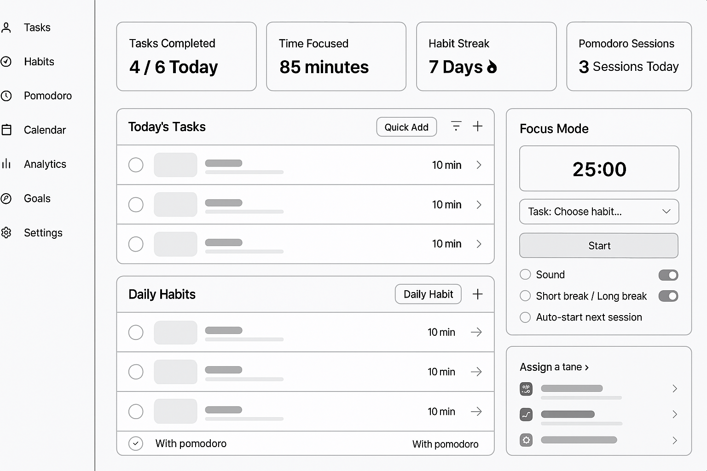

# 🔱 TriFocus - Productivity Dashboard

TriFocus is a modern, minimal productivity dashboard to manage your **tasks, habits, focus sessions (Pomodoro)**, and track personal performance — all in one place. Built with **React + Firebase** for real-time sync and authentication.

---

## 📸 Preview

---

## 🚀 Features

### 🧠 Dashboard Overview

- Welcome banner with quote & background slider
- Daily task stats: tasks completed, focus time, habit streak
- Embedded Pomodoro timer
- Graphs (Daily, Weekly, Monthly analytics)

### ✅ Task Management

- Add, edit, delete tasks
- Mark complete/incomplete
- Optional focus time per task
- Filter & sort tasks
- Real-time updates from Firestore

### 🔁 Habit Tracker

- Track daily habits with streak counter
- Real-time updates

### ⏱ Pomodoro Timer

- Track time spent focusing
- Pomodoro sessions associated with tasks

### 📅 Calendar View

- View scheduled tasks and habits

### 📊 Analytics

- Task & focus visual insights

### 🔐 Authentication

- Login / Signup / Forgot Password using Firebase Auth
- Protected routes

---

## ⚙️ Tech Stack

- React (Vite or CRA)
- Firebase (Auth + Firestore)
- React Router DOM
- React Hot Toast
- Material Icons / React Icons
- Custom CSS Modules

---
